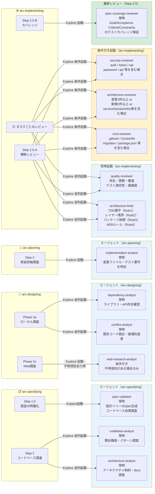
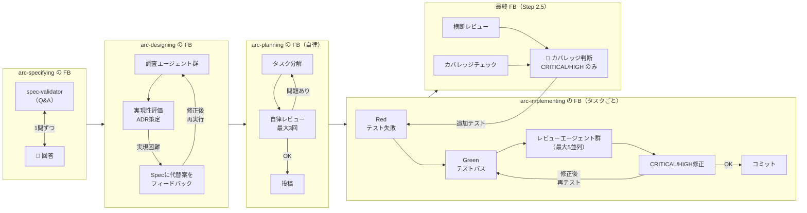

# Arc SDLC フロー図

---

## スキル一覧

| スキル | 呼び出し方 | 役割 | 自動移行 |
|--------|-----------|------|----------|
| **arc-specifying** | `/arc-specifying` | 意図（Why/What/Acceptance Criteria/Constraints/Domain Model）を明確化し、Specを作成する | なし（人間ゲートで停止） |
| **arc-designing** | `/arc-designing` | HOWを設計する。実現性確認・スコープ定義・ADR策定を行う | なし（人間ゲートで停止） |
| **arc-planning** | `/arc-planning` | SpecとDesignをTDDタスクに分解し、自律FBループで品質確認後に投稿する | arc-implementing へ自動移行 |
| **arc-implementing** | `/arc-implementing` | TDD（Red-Green）でタスクを自律実装し、専門レビューエージェントのFBループ後にPRを作成する | なし（PR作成前に人間ゲート） |
| **arc-cleaning** | `/arc-cleaning` | マージ済みworktreeを検出・削除し、ローカルを整理する | — |

---

## エージェント一覧

| エージェント | モデル | 役割 | 起動方式 |
|-------------|--------|------|----------|
| **spec-validator** | Opus | Issue内容から設計ツリーを展開。コードベース自律調査 + 推奨回答付きQ&Aリストを生成 | Explore |
| **codebase-analyst** | Opus | 類似機能・競合コード・踏襲すべきパターンを調査 | Explore |
| **architecture-analyst** | Opus | アーキテクチャ制約・既存docs・テスト基盤を調査 | Explore |
| **dependency-analyst** | Opus | ライブラリ・外部APIの存在とバージョン適合性を確認 | Explore |
| **conflict-analyst** | Opus | 既存コードとの競合・破壊的変更・パフォーマンス懸念を調査 | Explore |
| **web-research-analyst** | Opus | ライブラリのメンテ状況・セキュリティ・breaking changesをWeb検索で確認 | Explore（条件付き） |
| **implementation-analyst** | Opus | 変更が必要な全ファイルとテスト要件を特定し、タスクの依存順序を整理 | Explore |
| **quality-reviewer** | Opus | 命名・責務・重複・テスト適切性・複雑度をレビュー | Explore |
| **architecture-linter** | Opus | TDD遵守・レイヤー境界・パッケージ制限・ADRルールを静的チェック | Explore |
| **security-reviewer** | Opus | OWASP Top 10・認証・入力検証・機密データ露出をレビュー | Explore（条件付き） |
| **architecture-reviewer** | Opus | 関心の分離・依存方向・ADR整合性・結合問題をレビュー | Explore（条件付き） |
| **cicd-reviewer** | Opus | ビルド失敗・マイグレーション漏れ・デプロイ順序問題をレビュー | Explore（条件付き） |
| **spec-coverage-reviewer** | Opus | Goal/Acceptance Criteria/Constraintsに対応するテストカバレッジを検証 | Explore |

---

## スキルとエージェントの対応表

| エージェント | arc-specifying | arc-designing | arc-planning | arc-implementing ⑥ | arc-implementing 2.5 |
|-------------|:--------------:|:-------------:|:------------:|:-------------------:|:--------------------:|
| spec-validator | ✅ 常時 | | | | |
| codebase-analyst | ✅ 常時 | | | | |
| architecture-analyst | ✅ 常時 | | | | |
| dependency-analyst | | ✅ 常時 | | | |
| conflict-analyst | | ✅ 常時 | | | |
| web-research-analyst | | 🔶 条件付き | | | |
| implementation-analyst | | | ✅ 常時 | | |
| quality-reviewer | | | | ✅ 常時 | ✅ 常時 |
| architecture-linter | | | | ✅ 常時 | ✅ 常時 |
| security-reviewer | | | | 🔶 条件付き | 🔶 条件付き |
| architecture-reviewer | | | | 🔶 条件付き | 🔶 条件付き |
| cicd-reviewer | | | | 🔶 条件付き | 🔶 条件付き |
| spec-coverage-reviewer | | | | | ✅ 常時 |

> ✅ 常時起動 / 🔶 変更内容によって条件起動

---

## フェーズ概要

```mermaid
flowchart LR
    Issue[["🎫 Issue\n（要望・課題）"]]

    subgraph S["📋 Specifying\n意図を明確にする"]
        s1["Why\nなぜ必要か"]
        s2["What\n何を達成するか"]
        s3["Acceptance Criteria\nビジネス視点での完了条件"]
        s4["Constraints\nビジネス制約"]
        s5["Domain Model\nことばの定義"]
    end

    subgraph D["🔧 Designing\nHOWを設計する"]
        d1["実現性確認"]
        d2["スコープ定義"]
        d3["ADR策定"]
    end

    subgraph P["📝 Planning\nタスクに分解する"]
        p1["TDDタスク分解\n[test]→[impl]"]
        p2["Goal→タスク\nトレーサビリティ"]
    end

    subgraph I["⚙️ Implementing\n自律実装する"]
        i1["Red-Green\nTDDサイクル"]
        i2["レビューFB\nエージェント群"]
        i3["最終横断\nレビュー"]
        i4["PR作成"]
    end

    HG1{{"👤 Spec承認"}}
    HG2{{"👤 方向性確認"}}
    HG3{{"👤 カバレッジ確認"}}
    HG4{{"👤 PR承認"}}
    PR[["🔀 Pull Request"]]

    Issue --> S --> HG1 --> D --> HG2 --> P -->|"🤖 自動"| I
    I --> HG3 --> HG4 --> PR

    style HG1 fill:#ff9900,color:#000
    style HG2 fill:#ff9900,color:#000
    style HG3 fill:#ff9900,color:#000
    style HG4 fill:#ff9900,color:#000
```

> **人間が関与するのは4箇所のみ。** それ以外はAIが自律的に判断・実行・修正する。

---

## 1. 全体フロー（スキル・ゲート・データフロー）

```mermaid
flowchart TD
    Issue[["🎫 GitHub Issue"]]

    %% ─────────────────────────────
    %% arc-specifying
    %% ─────────────────────────────
    subgraph SPEC["📋 /arc-specifying"]
        direction TB
        S1["Step 1\nIssue取得 + worktree作成"]
        S15["Step 1.5\n意図の明確化\n1問ずつQ&A"]
        S2["Step 2\n並列コードベース調査"]
        S3["Step 3\nSpec作成・投稿"]
        S4["Step 4\nDocs生成"]
        S1 --> S15 --> S2 --> S3 --> S4
    end

    HG1{{"👤 人間ゲート\nSpec承認"}}
    GH_spec[("<!-- arc:spec -->\n意図のみ\nWhy/What/AC\nConstraints\nDomain Model")]

    %% ─────────────────────────────
    %% arc-designing
    %% ─────────────────────────────
    subgraph DESIGN["🔧 /arc-designing"]
        direction TB
        D1["Step 1\nSpec取得"]
        D2["Step 2\n並列技術調査\n（ローカル + Web）"]
        D3["Step 3\n実現性評価・ADR策定"]
        D4["Step 4\nスコープ定義・Phase分け"]
        D5["Step 5\n設計結果を投稿"]
        D1 --> D2 --> D3 --> D4 --> D5
    end

    HG2{{"👤 方向性確認\n手動で /arc-planning 実行"}}
    GH_design[("<!-- arc:design -->\nHOW\nスコープ / ADR\n実現性評価")]

    %% ─────────────────────────────
    %% arc-planning
    %% ─────────────────────────────
    subgraph PLAN["📝 /arc-planning"]
        direction TB
        P1["Step 1\nSpec + Design取得"]
        P2["Step 2\n実装詳細調査"]
        P3["Step 3\nTDDタスク分解"]
        P35["Step 3.5\nGoal→タスク\nトレーサビリティ"]
        P4["Step 4\n自律タスクレビューFBループ"]
        P5["Step 5\nタスクコメント投稿"]
        P1 --> P2 --> P3 --> P35 --> P4 --> P5
    end

    GH_tasks[("<!-- arc:tasks -->\n[test]/[impl]\nタスクリスト\nGoal→Task対応表")]

    %% ─────────────────────────────
    %% arc-implementing
    %% ─────────────────────────────
    subgraph IMPL["⚙️ /arc-implementing"]
        direction TB
        I1["Step 1\nタスク + Spec + Design取得"]

        subgraph TDD["🔄 TDD実装ループ（全タスク完了まで）"]
            direction TB
            IT["① テストを書く（Red）"]
            IR["② テスト実行 → 失敗確認"]
            II["④ 実装コードを書く（Green）"]
            IG["⑤ テスト実行 → パス確認"]
            IRV["⑥ レビューエージェント\n並列起動"]
            IFX["⑦ 指摘統合・CRITICAL/HIGH修正"]
            ID["⑧ Docs更新"]
            IC["⑨ コミット"]
            IT --> IR --> II --> IG --> IRV --> IFX -->|"修正後 再テスト"| IG
            IFX --> ID --> IC
            IC -->|"次の未完了タスクへ"| IT
        end

        subgraph FINAL["🔍 Step 2.5: 最終横断レビュー"]
            FA["2.5-A: 横断レビューエージェント群\n（⑥と同じ選択ルール）"]
            FB["2.5-B: spec-coverage-reviewer\n（常時）"]
        end

        HG3{{"👤 カバレッジ確認\nCRITICAL/HIGH のみ"}}
        I_PR["Step 3\nPR自動作成"]

        I1 --> TDD
        IC -->|"全タスク完了"| FINAL
        FA --> HG3
        FB --> HG3
        HG3 -->|"テスト追加"| IT
        HG3 -->|"スキップ"| HG4
    end

    HG4{{"👤 PR作成承認"}}
    PR[["🔀 Pull Request\n→ Issue自動クローズ"]]

    %% ─────────────────────────────
    %% データフローと遷移
    %% ─────────────────────────────
    Issue --> SPEC
    S3 -->|投稿| GH_spec
    SPEC --> HG1
    HG1 -->|承認| DESIGN
    GH_spec -->|取得| D1
    D5 -->|投稿| GH_design
    DESIGN --> HG2
    HG2 -->|"/arc-planning 実行"| PLAN
    GH_spec -->|取得| P1
    GH_design -->|取得| P1
    P5 -->|投稿| GH_tasks
    PLAN -->|"🤖 自動移行"| IMPL
    GH_tasks -->|取得| I1
    GH_spec -->|取得| I1
    GH_design -->|取得| I1
    HG4 -->|承認| I_PR
    I_PR --> PR

    %% スタイル
    style HG1 fill:#ff9900,color:#000
    style HG2 fill:#ff9900,color:#000
    style HG3 fill:#ff9900,color:#000
    style HG4 fill:#ff9900,color:#000
    style GH_spec fill:#0075ca,color:#fff
    style GH_design fill:#0075ca,color:#fff
    style GH_tasks fill:#0075ca,color:#fff
```

---

## 2. エージェントマップ（どのスキルがどのエージェントをいつ起動するか）

---

## 3. FBループ構造（品質担保の仕組み）

