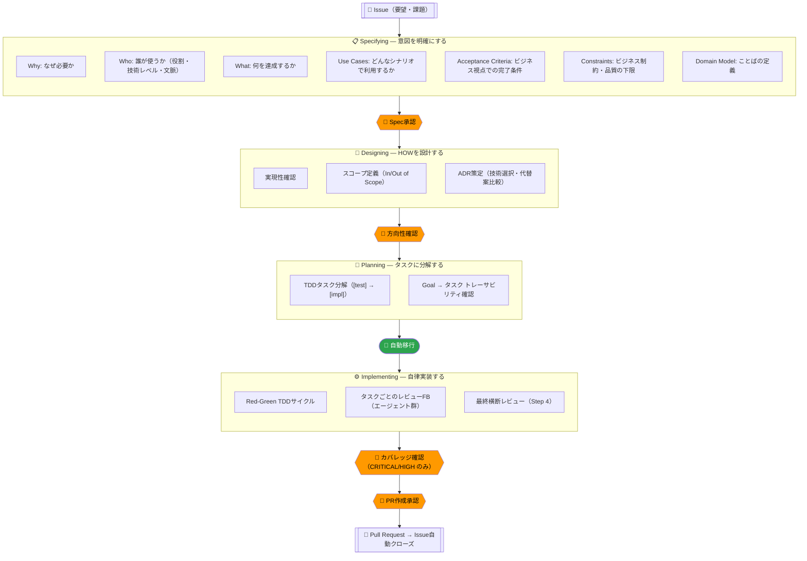
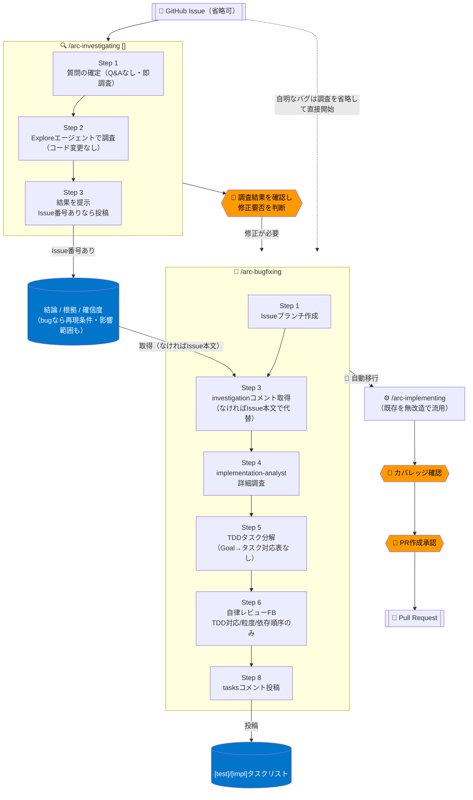

# Arc SDLC フロー図

---

## スキル一覧

| スキル | 呼び出し方 | 役割 | 自動移行 |
|--------|-----------|------|----------|
| **arc-specifying** | `/arc-specifying` | 意図（Why/Who/What/Use Cases/Acceptance Criteria/Constraints/Domain Model）を明確化し、Specを作成する | なし（人間ゲートで停止） |
| **arc-designing** | `/arc-designing` | HOWを設計する。実現性確認・スコープ定義・ADR策定を行う | なし（人間ゲートで停止） |
| **arc-planning** | `/arc-planning` | SpecとDesignをTDDタスクに分解し、自律FBループで品質確認後に投稿する | arc-implementing へ自動移行 |
| **arc-implementing** | `/arc-implementing` | TDD（Red-Green）でタスクを自律実装し、専門レビューエージェントのFBループ後にPRを作成する | なし（PR作成前に人間ゲート） |
| **arc-cleaning** | `/arc-cleaning` | マージ済みworktreeを検出・削除し、ローカルを整理する | — |
| **arc-investigating** | `/arc-investigating [<N>]` | コードベース・設計に関する質問を即座に調査して回答する（コードは変更しない）。spec/designは作らない | なし（人間が調査結果を見て判断） |
| **arc-bugfixing** | `/arc-bugfixing <N>` | bug修正をTDDタスクに分解する。arc-planningのbug fix版でspec/designは作らない | arc-implementing へ自動移行 |

---

## エージェント一覧

| エージェント | モデル | 役割 | 起動方式 |
|-------------|--------|------|----------|
| **spec-clarifier** | Sonnet | Why/Who/What/Use Cases/Constraints/Domain Modelの6軸で設計ツリーを展開。コードベース自律調査 + 推奨回答付きQ&Aリストを生成 | Explore |
| **spec-reviewer** | Sonnet | 作成済みSpecを5観点でレビュー（完全性・ACテスト可能性・UC↔Goal整合・Constraints計測可能性・内部整合性）。CRITICALは人間確認、HIGHは自動修正 | Explore |
| **design-clarifier** | Sonnet | Phase 1（Specのみ・Step 2）: 踏襲型/変革型を判断し調査戦略を決定。Phase 2（調査結果後・Step 4）: アーキテクチャ・データモデル・統合方式・テスト戦略のHOW判断をQ&Aで確認する | Explore |
| **design-reviewer** | Sonnet | 作成済みDesignをSpecと照合し、Spec要件カバレッジ・トレーサビリティ完全性・Constraintガードレール・テスト戦略を検証する | Explore |
| **codebase-analyst** | Sonnet | 踏襲型: 類似機能・パターン・再利用可能コンポーネントを調査。変革型: 変更対象実装・影響範囲を特定 | Explore |
| **architecture-analyst** | Sonnet | アーキテクチャ制約・既存docs・テスト基盤を調査（設計判断の前提として利用） | Explore（変革型は常時／踏襲型は条件付き） |
| **dependency-analyst** | Sonnet | ライブラリ・外部APIの存在とバージョン適合性・破壊的変更リスクを確認 | Explore（変革型は常時／踏襲型は条件付き） |
| **performance-analyst** | Sonnet | クエリパターン・キャッシュ設計・同時実行・スケーラビリティのパフォーマンス設計制約を調査 | Explore（条件付き） |
| **security-analyst** | Sonnet | 認証・認可モデル・データ機密性・脅威ベクターのセキュリティ設計制約を特定 | Explore（条件付き） |
| **web-research-analyst** | Sonnet | ライブラリのメンテ状況・セキュリティ・breaking changesをWeb検索で確認 | Explore（条件付き） |
| **implementation-analyst** | Sonnet | 変更が必要な全ファイルとテスト要件を特定し、タスクの依存順序を整理 | Explore |
| **quality-reviewer** | Sonnet | 命名・責務・重複・テスト適切性・複雑度をレビュー | Explore |
| **architecture-linter** | Sonnet | TDD遵守・レイヤー境界・パッケージ制限・ADRルールを静的チェック | Explore |
| **security-reviewer** | Sonnet | OWASP Top 10・認証・入力検証・機密データ露出をレビュー | Explore（条件付き） |
| **architecture-reviewer** | Sonnet | 関心の分離・依存方向・ADR整合性・結合問題をレビュー | Explore（条件付き） |
| **cicd-reviewer** | Sonnet | ビルド失敗・マイグレーション漏れ・デプロイ順序問題をレビュー | Explore（条件付き） |
| **spec-coverage-reviewer** | Sonnet | Goal/Acceptance Criteria/Constraintsに対応するテストカバレッジを検証 | Explore |

> `arc-investigating` は専用エージェントファイルを持たない。`Explore` エージェントに調査内容をそのまま渡して起動する（軽量さ優先）。`arc-bugfixing` は implementation-analyst を再利用する（Specの代わりにinvestigationコメント／Issue本文を入力する）。

---

## スキルとエージェントの対応表

| エージェント＼スキル | arc-specifying | arc-designing | arc-planning | arc-implementing | arc-investigating | arc-bugfixing |
|-------------|:--------------:|:-------------:|:------------:|:----------------:|:------------------:|:-------------:|
| spec-clarifier | ✅ 常時 | | | | | |
| spec-reviewer | ✅ 常時 | | | | | |
| design-clarifier | | ✅ 常時 | | | | |
| design-reviewer | | ✅ 常時 | | | | |
| codebase-analyst | | ✅ 常時 | | | | |
| architecture-analyst | | 🔷 変革型常時/踏襲型条件付き | | | | |
| dependency-analyst | | 🔷 変革型常時/踏襲型条件付き | | | | |
| performance-analyst | | 🔶 条件付き | | | | |
| security-analyst | | 🔶 条件付き | | | | |
| web-research-analyst | | 🔶 条件付き | | | | |
| implementation-analyst | | | ✅ 常時 | | | ✅ 常時 |
| quality-reviewer | | | | ✅ 常時 | | |
| architecture-linter | | | | ✅ 常時 | | |
| security-reviewer | | | | 🔶 条件付き | | |
| architecture-reviewer | | | | 🔶 条件付き | | |
| cicd-reviewer | | | | 🔶 条件付き | | |
| spec-coverage-reviewer | | | | ✅ 最終のみ | | |
| Explore（汎用） | | | | | ✅ 常時 | |

> ✅ 常時起動 / 🔶 変更内容によって条件起動 / 🔷 変革型は常時・踏襲型はキーワード条件付き / ✅ 最終のみ = 全タスク完了後の Step 4 でのみ起動

---

## フェーズ概要

> **人間が関与するのは4箇所のみ。** それ以外はAIが自律的に判断・実行・修正する。

---

## 1. 全体フロー（スキル・ゲート・データフロー）

```mermaid
flowchart TD
    Issue[["🎫 GitHub Issue"]]

    %% ─────────────────────────────
    %% arc-specifying
    %% ─────────────────────────────
    subgraph SPEC["📋 /arc-specifying"]
        direction TB
        S1["Step 1\nパーミッション設定チェック"]
        S2["Step 2\nIssue取得 + ブランチ作成"]
        S3["Step 3\n意図の明確化\n1問ずつQ&A"]
        S4["Step 4\nSpec作成"]
        S5["Step 5\nspec-reviewer\n品質チェック"]
        S6["Step 6\nDocs生成"]
        S7["Step 7\nコミット・完全停止"]
        S1 --> S2 --> S3 --> S4 --> S5 --> S6 --> S7
    end

    HG1{{"👤 人間ゲート\nSpec承認"}}
    GH_spec[("<!-- arc:spec -->\n意図のみ\nWhy / Who / What\nUse Cases\nAcceptance Criteria\nConstraints / Domain Model")]

    %% ─────────────────────────────
    %% arc-designing
    %% ─────────────────────────────
    subgraph DESIGN["🔧 /arc-designing"]
        direction TB
        D1["Step 1\nSpec取得"]
        D2["Step 2\ndesign-clarifier Phase 1\n踏襲型/変革型判断"]
        D3["Step 3\n並列技術調査\n（ローカル + Web）"]
        D4["Step 4\ndesign-clarifier Phase 2\nHOW判断Q&A"]
        D5["Step 5\n実現性評価・ADR策定"]
        D6["Step 6\nスコープ定義・Phase分け"]
        D7["Step 7\n設計結果を投稿"]
        D1 --> D2 --> D3 --> D4 --> D5 --> D6 --> D7
    end

    HG2{{"👤 方向性確認\n手動で /arc-planning 実行"}}
    GH_design[("<!-- arc:design -->\nHOW\nスコープ / ADR\n実現性評価")]

    %% ─────────────────────────────
    %% arc-planning
    %% ─────────────────────────────
    subgraph PLAN["📝 /arc-planning"]
        direction TB
        P1["Step 1\nsub-agent委譲"]
        P2["Step 2\nSpec + Design取得"]
        P3["Step 3\n実装詳細調査"]
        P4["Step 4\nTDDタスク分解"]
        P5["Step 5\nGoal→タスク\nトレーサビリティ"]
        P6["Step 6\n自律タスクレビューFBループ"]
        P7["Step 7\nworktree判断"]
        P8["Step 8\nタスクコメント投稿"]
        P1 --> P2 --> P3 --> P4 --> P5 --> P6 --> P7 --> P8
    end

    GH_tasks[("<!-- arc:tasks -->\n[test]/[impl]\nタスクリスト\nGoal→Task対応表")]

    %% ─────────────────────────────
    %% arc-implementing
    %% ─────────────────────────────
    subgraph IMPL["⚙️ /arc-implementing"]
        direction TB
        I1["Step 1-2\nタスク + Spec + Design取得\n+ TaskCreate登録"]

        subgraph TDD["🔄 タスクペアサブエージェントループ（全ペア完了まで）"]
            direction TB
            ISUB["🤖 タスクペアサブエージェント\n[test]+[impl] 1ペア = 1サブエージェント\nspec+design をプロンプトに埋め込んで起動"]
            IT["① テストを書く（Red）"]
            IR["② テスト実行 → 失敗確認"]
            II["③ 実装コードを書く（Green）"]
            IG["④ テスト実行 → パス確認"]
            ISC["⑤ type-check 実行"]
            IT2["⑥ テスト再実行 → 最終確認"]
            ID["⑦ Docs更新"]
            IC["⑧ コミット（最大3回リトライ）"]
            ISUB --> IT --> IR --> II --> IG --> ISC --> IT2 --> ID --> IC
            IC -->|"次のペアへ"| ISUB
        end

        subgraph FINAL["🔍 Step 4: 最終横断レビュー（サブエージェント）"]
            FA["🤖 レビューサブエージェント\nquality / architecture-linter\n+ 条件付き3エージェント\n+ spec-coverage-reviewer"]
        end

        HG3{{"👤 カバレッジ確認\nCRITICAL/HIGH のみ"}}
        I_PR["Step 5\nPR自動作成"]

        I1 --> TDD
        IC -->|"全ペア完了"| FINAL
        FA --> HG3
        HG3 -->|"テスト追加"| IT
        HG3 -->|"スキップ"| HG4
    end

    HG4{{"👤 PR作成承認"}}
    PR[["🔀 Pull Request\n→ Issue自動クローズ"]]

    %% ─────────────────────────────
    %% データフローと遷移
    %% ─────────────────────────────
    Issue --> SPEC
    S4 -->|投稿| GH_spec
    SPEC --> HG1
    HG1 -->|承認| DESIGN
    GH_spec -->|取得| D1
    D7 -->|投稿| GH_design
    DESIGN --> HG2
    HG2 -->|"/arc-planning 実行"| PLAN
    GH_spec -->|取得| P2
    GH_design -->|取得| P2
    P8 -->|投稿| GH_tasks
    PLAN -->|"🤖 自動移行"| IMPL
    GH_tasks -->|取得| I1
    GH_spec -->|取得| I1
    GH_design -->|取得| I1
    HG4 -->|承認| I_PR
    I_PR --> PR

    %% スタイル
    style HG1 fill:#ff9900,color:#000
    style HG2 fill:#ff9900,color:#000
    style HG3 fill:#ff9900,color:#000
    style HG4 fill:#ff9900,color:#000
    style GH_spec fill:#0075ca,color:#fff
    style GH_design fill:#0075ca,color:#fff
    style GH_tasks fill:#0075ca,color:#fff
```

---

## 2. エージェントマップ（どのスキルがどのエージェントをいつ起動するか）

```mermaid
flowchart TD
    %% ─────────────────────────────
    %% arc-specifying
    %% ─────────────────────────────
    subgraph SPEC["📋 arc-specifying"]
        direction TB
        sv["spec-clarifier 【Step 3 常時】\n設計ツリーQ&A / コードベース自律調査\n（Domain Model確認・既存API確認など）"]
        srw["spec-reviewer 【Step 5 常時】\n完全性・ACテスト可能性\nUC↔Goal整合 / Constraints計測可能性 / 内部整合性"]
        sv --> srw
    end

    %% ─────────────────────────────
    %% arc-designing
    %% ─────────────────────────────
    subgraph DESIGN["🔧 arc-designing"]
        direction TB
        dc["design-clarifier\nStep 2 常時: Phase 1 踏襲型/変革型の判断\nStep 4 調査完了後: Phase 2 HOW判断Q&A"]
        cb["codebase-analyst 【Phase 2a 常時 並列①】\n踏襲型: 参考パターン・再利用コンポーネント調査\n変革型: 変更対象の既存実装・影響範囲を特定"]
        aa["architecture-analyst 【Phase 2a 変革型常時/踏襲型条件付き 並列②】\nアーキテクチャ制約・既存docs・テスト基盤調査"]
        dep["dependency-analyst 【Phase 2a 変革型常時/踏襲型条件付き 並列③】\nライブラリ・API存在確認・バージョン適合性\n破壊的変更リスク"]
        perf["performance-analyst 【Phase 2a 🔶条件付き 並列④】\nパフォーマンス|スケール|レイテンシ|キャッシュ|同時|大量\nをspecに含む場合のみ起動"]
        secan["security-analyst 【Phase 2a 🔶条件付き 並列⑤】\n認証|認可|ログイン|パスワード|API|ユーザー|権限|トークン\nをspecに含む場合のみ起動"]
        web["web-research-analyst 【Phase 2c 🔶条件付き】\n不明ライブラリ・外部API・セキュリティ情報をWeb確認"]
        drw["design-reviewer 【Step 7-b 常時】\nSpec要件カバレッジ・トレーサビリティ完全性\nConstraintガードレール・テスト戦略明示"]
        dc --> cb --> aa --> dep --> perf --> secan --> web --> drw
    end

    %% ─────────────────────────────
    %% arc-planning
    %% ─────────────────────────────
    subgraph PLAN["📝 arc-planning"]
        direction TB
        ia["implementation-analyst 【Step 3 常時】\n変更が必要な全ファイルとテスト要件を特定\nタスクの依存順序を整理"]
    end

    %% ─────────────────────────────
    %% arc-implementing タスクペアサブエージェント
    %% ─────────────────────────────
    subgraph IMPLSUB["⚙️ arc-implementing タスクペアサブエージェント（ペアごと）"]
        direction TB
        sub1["🤖 タスクペアサブエージェント\nspec+design をプロンプトに埋め込み\n[test]+[impl] を1サブエージェントで処理"]
        sub2["① Red: テスト記述"]
        sub3["② Green: 実装"]
        sub4["③ type-check / lint スクリプト"]
        sub5["④ コミット（最大3回リトライ）"]
        sub1 --> sub2 --> sub3 --> sub4 --> sub5
    end

    %% ─────────────────────────────
    %% arc-implementing Step 4（最終横断・サブエージェント）
    %% ─────────────────────────────
    subgraph IMPL25["⚙️ arc-implementing Step 4（最終横断・サブエージェント）"]
        direction TB
        qr2["quality-reviewer 【常時】"]
        al2["architecture-linter 【常時】"]
        sec3["security-reviewer 【🔶条件付き】"]
        ar2["architecture-reviewer 【🔶条件付き】"]
        ci2["cicd-reviewer 【🔶条件付き】"]
        scr["spec-coverage-reviewer 【常時】\nGoal / Acceptance Criteria\n/ Constraints のカバレッジ検証"]
        qr2 --> al2 --> sec3 --> ar2 --> ci2 --> scr
    end

    SPEC --> DESIGN --> PLAN --> IMPLSUB --> IMPL25

    style SPEC fill:#f0f7ff
    style DESIGN fill:#f0f7ff
    style PLAN fill:#f0f7ff
    style IMPL6 fill:#f0f7ff
    style IMPL25 fill:#f0f7ff
```

---

## 3. FBループ構造（品質担保の仕組み）

```mermaid
flowchart TD
    subgraph SPEC_FB["📋 arc-specifying の FB"]
        direction TB
        sv2["spec-clarifier（設計ツリー展開・調査）"]
        HU1["👤 回答（推奨回答付き・1問ずつ）"]
        sv2 -->|"質問を提示"| HU1
        HU1 -->|"回答を受けて次の質問"| sv2
        srw2["spec-reviewer（品質チェック）"]
        HU1 -->|"全質問消化 → Spec作成"| srw2
        srw2 -->|"HIGH: 自動修正 → 再実行（最大2回）"| srw2
        srw2 -->|"CRITICAL: 人間確認"| HU_crit["👤 根本矛盾の確認"]
        HU_crit -->|"修正指示"| sv2
    end

    subgraph DESIGN_FB["🔧 arc-designing の FB"]
        direction TB
        inv["調査エージェント群（5並列 + Web条件付き）"]
        dc2["design-clarifier（HOW判断Q&A）"]
        HUD["👤 回答（推奨回答付き・1問ずつ）"]
        eval["設計作成（トレーサビリティ含む）"]
        drw2["design-reviewer（品質チェック）"]
        alt["👤 代替案選択（AskUserQuestion）"]
        inv --> dc2
        dc2 -->|"質問を提示"| HUD
        HUD -->|"回答を受けて次の質問"| dc2
        HUD -->|"全質問消化"| eval
        eval -->|"実現困難"| alt
        alt -->|"方針確定 → 再設計"| eval
        eval --> drw2
        drw2 -->|"HIGH: 自動修正 → 再実行（最大2回）"| drw2
        drw2 -->|"CRITICAL: 人間確認"| HUD_crit["👤 設計欠落の確認"]
        HUD_crit -->|"修正指示"| eval
    end

    subgraph PLAN_FB["📝 arc-planning の FB（自律）"]
        direction TB
        task["TDDタスク分解"]
        review["自律レビュー（最大3回）\nTDD対応 / Specカバレッジ\n粒度 / 依存順序 / インフラ"]
        task --> review
        review -->|"問題あり → 修正"| task
        review -->|"OK"| post["タスクコメント投稿"]
    end

    subgraph IMPL_FB["⚙️ arc-implementing の FB（タスクペアサブエージェント）"]
        direction TB
        sub_a["🤖 タスクペアサブエージェント起動\nspec+design をプロンプトに埋め込み"]
        red["① テストを書く（Red）"]
        green["② 実装コードを書く（Green）"]
        scripts["③ type-check / lint スクリプト実行"]
        commit["④ コミット（最大3回リトライ）"]
        sub_a --> red --> green --> scripts --> commit
        commit -->|"次のペアへ"| sub_a
    end

    subgraph FINAL_FB["🔍 最終 FB（Step 4・レビューサブエージェント）"]
        direction TB
        cross["🤖 レビューサブエージェント\nquality / architecture-linter\n+ 条件付き3エージェント\n+ spec-coverage-reviewer"]
        HU2["👤 カバレッジ確認（CRITICAL/HIGH のみ）"]
        cross --> HU2
        HU2 -->|"テスト追加"| addtest["テスト実装 → GREEN確認 → コミット"]
        HU2 -->|"スキップ"| pr["PR作成へ"]
    end

    SPEC_FB --> DESIGN_FB --> PLAN_FB --> IMPL_FB --> FINAL_FB
```

---

## 4. bug fix / 調査系トラック

spec/designを持たない軽量フロー。新機能開発の4フェーズフロー（specifying→designing→planning→implementing）とは独立しており、`arc-implementing` のみを共有する。

**既存4フェーズフローとの違い**:
- spec・designのステップが存在しない（Goal/Use Cases/Acceptance Criteria/ADRを固める必要がないため）
- `arc-investigating` はIssue番号なしでも使えるアドホックな調査ツール。コード変更・PR作成を一切伴わない
- `arc-bugfixing` のタスクレビューFBはGoal/ACカバレッジチェックを行わない（specが存在しないため）
- `arc-implementing` は無改造で流用する。spec/designコメントが無い分、Step 4のspec-coverage-reviewerの起動やPR本文のSummary抽出は空振りになるが許容している
